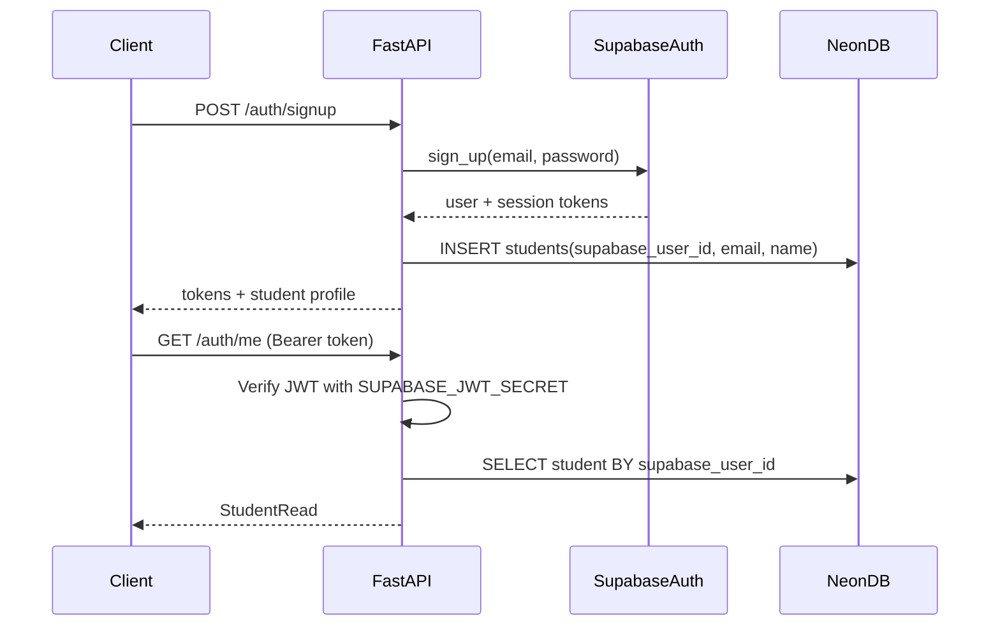

# Supabase Authentication Integration Plan

## Architecture

Supabase handles identity (signup, login, JWT issuance). Neon PostgreSQL remains the app database. FastAPI proxies auth calls and validates tokens on protected routes.



**Key decision:** Keep existing `students.id` as internal PK. Add a new unique `supabase_user_id` column to link Supabase `auth.users.id` (`sub` JWT claim) without breaking existing FKs across 10+ tables.

---

## 1. Supabase Project Setup (manual, one-time)

You will need to create a Supabase project (or use an existing one) and add these to [`.env.local`](.env.local):

```env
SUPABASE_URL=https://<project-ref>.supabase.co
SUPABASE_ANON_KEY=<anon-key>
SUPABASE_JWT_SECRET=<jwt-secret>
```

Optional (admin tasks only): `SUPABASE_SERVICE_ROLE_KEY`

In Supabase Dashboard:
- Enable **Email** provider under Authentication > Providers
- Set **Site URL** to your dev origin (e.g. `http://localhost:8000`)
- Decide on email confirmation: for hackathon dev, disable "Confirm email" initially so signup works immediately

---

## 2. Database Migration

Add Supabase linkage to [`app/models/__init__.py`](app/models/__init__.py) `Student` model:

- `supabase_user_id`: `UUID`, unique, indexed, nullable initially (for any pre-existing rows)
- New Alembic revision `002_add_supabase_user_id.py`

```python
supabase_user_id: Mapped[uuid.UUID | None] = mapped_column(
    UUID(as_uuid=True), unique=True, nullable=True, index=True
)
```

Update [`app/schemas/__init__.py`](app/schemas/__init__.py):
- `AuthSignupRequest`: email, password, name, phone_number (optional)
- `AuthLoginRequest`: email, password
- `AuthRefreshRequest`: refresh_token
- `AuthTokenResponse`: access_token, refresh_token, token_type, expires_in, student

---

## 3. Config & Dependencies

Update [`app/config.py`](app/config.py) with Supabase settings:

```python
supabase_url: str
supabase_anon_key: str
supabase_jwt_secret: str
```

Add to [`requirements.txt`](requirements.txt):
- `supabase>=2.0.0` — official client for auth proxy calls
- `PyJWT>=2.9.0` — verify Supabase JWTs server-side
- `httpx` (transitive via supabase, but pin if needed)

---

## 4. Auth Service Layer

Create [`app/services/auth.py`](app/services/auth.py):

| Function | Responsibility |
|---|---|
| `signup_user()` | Call `supabase.auth.sign_up()`, create `Student` row with `supabase_user_id`, `email`, `name` |
| `login_user()` | Call `supabase.auth.sign_in_with_password()`, fetch linked student |
| `refresh_session()` | Call `supabase.auth.refresh_session()` |
| `verify_access_token()` | Decode JWT with `SUPABASE_JWT_SECRET`, validate `exp`/`sub` |
| `get_student_by_supabase_id()` | DB lookup by `supabase_user_id` |

**Signup flow detail:** If Supabase returns a user but student insert fails, roll back by documenting cleanup (or use service role to delete orphan auth user — optional enhancement).

**Login flow detail:** If Supabase auth succeeds but no `students` row exists (edge case), auto-provision student from JWT claims on first `/auth/me` call.

---

## 5. Auth Dependencies (JWT Guard)

Create [`app/dependencies/auth.py`](app/dependencies/auth.py):

```python
async def get_current_student(
    credentials: HTTPAuthorizationCredentials = Depends(security),
    db: AsyncSession = Depends(get_db),
) -> Student:
    payload = verify_access_token(credentials.credentials)
    student = await get_student_by_supabase_id(db, UUID(payload["sub"]))
    if not student:
        raise HTTPException(404, "Student profile not found")
    return student
```

This becomes the standard guard for all future protected routes (progress, interviews, league, etc.).

---

## 6. Auth API Routes

Create [`app/routers/auth.py`](app/routers/auth.py) and register in [`app/main.py`](app/main.py):

| Endpoint | Auth | Description |
|---|---|---|
| `POST /auth/signup` | Public | Email/password signup + student creation |
| `POST /auth/login` | Public | Returns tokens + student profile |
| `POST /auth/refresh` | Public | Exchange refresh_token for new access_token |
| `GET /auth/me` | Protected | Current student profile from JWT |
| `POST /auth/logout` | Protected | Client-side token discard + optional Supabase sign_out |

Add CORS middleware in [`app/main.py`](app/main.py) for future frontend (`allow_origins` from env).

---

## 7. Error Handling

Map Supabase errors to FastAPI HTTP exceptions in the auth service:

- Invalid credentials → `401 Unauthorized`
- Email already registered → `409 Conflict`
- Weak password / validation → `422 Unprocessable Entity`
- Expired/invalid JWT → `401 Unauthorized`

---

## 8. Security Notes

- Never expose `SUPABASE_SERVICE_ROLE_KEY` to clients; only `ANON_KEY` is used server-side for auth proxy (acceptable pattern when calls originate from your backend)
- Store all Supabase secrets in `.env.local` (already gitignored)
- Password validation: enforce minimum length in Pydantic schema (e.g. 8 chars) before calling Supabase

---

## Files to Create/Modify

| File | Action |
|---|---|
| [`app/config.py`](app/config.py) | Add Supabase env vars |
| [`app/models/__init__.py`](app/models/__init__.py) | Add `supabase_user_id` to Student |
| [`app/schemas/__init__.py`](app/schemas/__init__.py) | Add auth request/response schemas |
| `app/services/auth.py` | New — Supabase proxy + JWT verify |
| `app/dependencies/auth.py` | New — `get_current_student` guard |
| `app/routers/auth.py` | New — signup/login/refresh/me routes |
| [`app/main.py`](app/main.py) | Register router + CORS |
| `alembic/versions/002_add_supabase_user_id.py` | New migration |
| [`requirements.txt`](requirements.txt) | Add supabase, PyJWT |

---

## Verification Plan

1. Run `alembic upgrade head` — confirm `supabase_user_id` column exists
2. `POST /auth/signup` with test email/password — returns tokens + student
3. `GET /auth/me` with Bearer token — returns student profile
4. `POST /auth/login` — returns same student by email
5. `POST /auth/refresh` — returns fresh access_token
6. Invalid/expired token on `/auth/me` — returns 401
